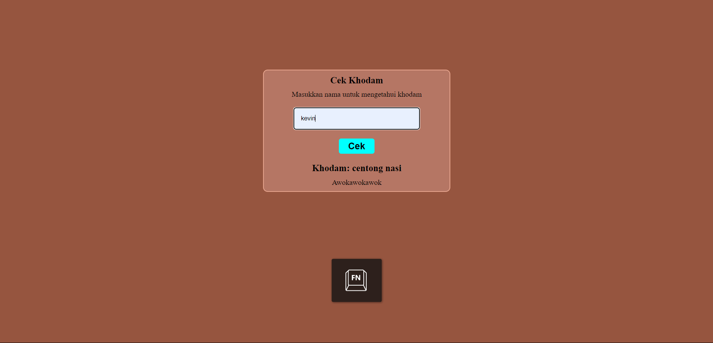

# Cek Khodam

Aplikasi berbasis web sederhana untuk mengecek Khodam menggunakan HTML, CSS, dan PHP.

## Daftar Isi

- [Pendahuluan](#pendahuluan)
- [Fitur](#fitur)
- [Teknologi yang Digunakan](#teknologi-yang-digunakan)
- [Instalasi](#instalasi)
- [Penggunaan](#penggunaan)
- [Kontribusi](#kontribusi)
- [Lisensi](#lisensi)

## Pendahuluan

**Cek Khodam** adalah aplikasi ringan yang memungkinkan pengguna untuk memeriksa Khodam nya. Aplikasi ini dibangun menggunakan HTML untuk struktur halaman, CSS untuk styling, dan PHP untuk menangani logika backend.

## Fitur

- Antarmuka pengguna yang sederhana dan mudah digunakan
- Desain responsif (dapat diakses di perangkat seluler dan desktop)
- Backend PHP sederhana untuk pemrosesan data
- Ringan dan cepat dalam memuat halaman



## Teknologi yang Digunakan

- **HTML** - Untuk struktur halaman web
- **CSS** - Untuk desain dan tata letak
- **PHP** - Untuk pengolahan data di sisi server

## Instalasi

1. Clone repositori ini ke direktori lokal:
   ```bash
   git clone https://github.com/rffdpryt/Cek_khodam.git
